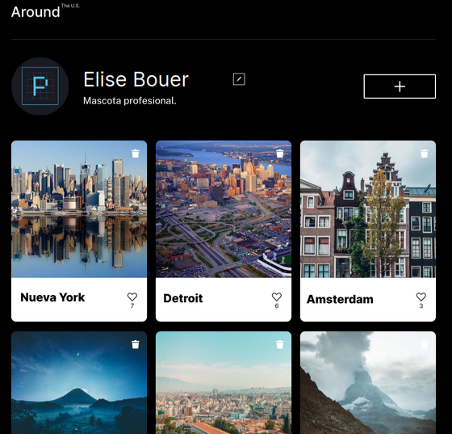
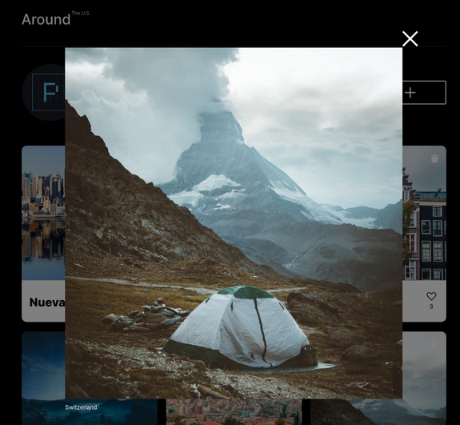
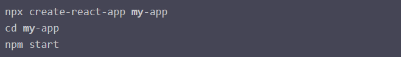

# Tripleten web_project_around_react

---

## Primera parte

## :astonished: De que trata?

### Esta será la primera etapa para adaptar el proyecto "Alrededor de Usa" a React, para lograr esto, se necesitará trasladar el marcado, y estilos para transformarlos al formato "JSX", además se empelará el uso de diversos componentes que nos permitirán agregar las primeras funcionalidades.

### imágenes del resultado final:

### En cuanto al espacio de trabajo, se utilizarán los siguientes comandos que nos permitirán instalar React:

 
____

## :interrobang: Que se aprendió en está etapa?

1. ### Utilizar los componentes principales para que el marcado "HTML", y los estilos "CSS" se mostrarán correctamente.

2. ### Renderizar los elementos comúnes de los formularios

3. ### En el componente App, colocar la funcionalidad necesaria, para que los formularios, y las imágenes, aparezcan y se cierren al hacer click.

4. ### Vincular las apis para que aparezcan las targetas, y los datos del ususario mediante el uso de los principales hooks (useEffect y userState)

---

## Segunda parte:

## :question: Que funcionalidades se implementarán?

### En esta parte se utilizarán nuevos hooks de React que permitirán completar las funcionalidades de cada sección, es decir, que la targetas funcionen completamente(eliminarlas, contador de likes etc), los formularios puedan recibir, su respectiva validación funcione y mostrar los datos introducidos. Para lograr todo lo anterior, será necesario vincular las "APIS" restantes para que tales datos seán mostrados correctamente.

---

## :interrobang: Que se aprendió en está etapa?

### Utilizar los nuevos hooks useContext y useRef

### Vincular los Context con las apis correspondientes, para que la solicitudes cumplan sus respectivas funciones.

### Utilizar los hooks aprendidos para que los "popups" se cierren al hacer click fuera de ellos y con la tecla "Escape"

### Implementar el useRef para que los flags permitan que los botones Guardando, y Crea pasen a los estados "Guardando.... y Creando..."

---

## Link del proyecto:

### https://melomario57.github.io/web_project_around_react/

---

## Tecnología principal utilizada:

&nbsp;
